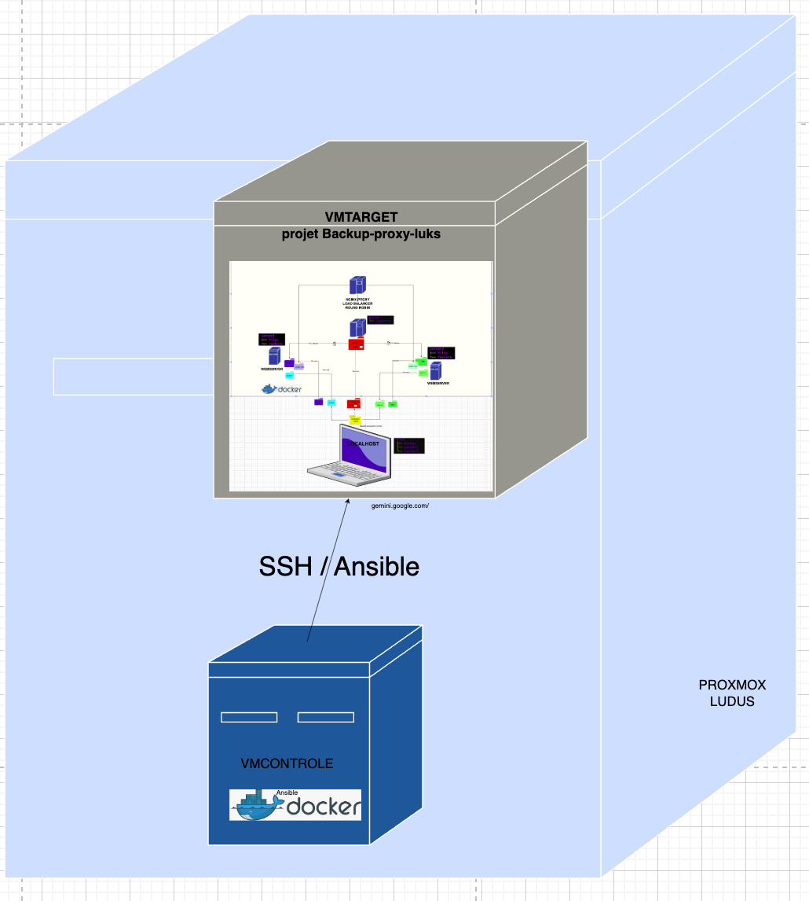
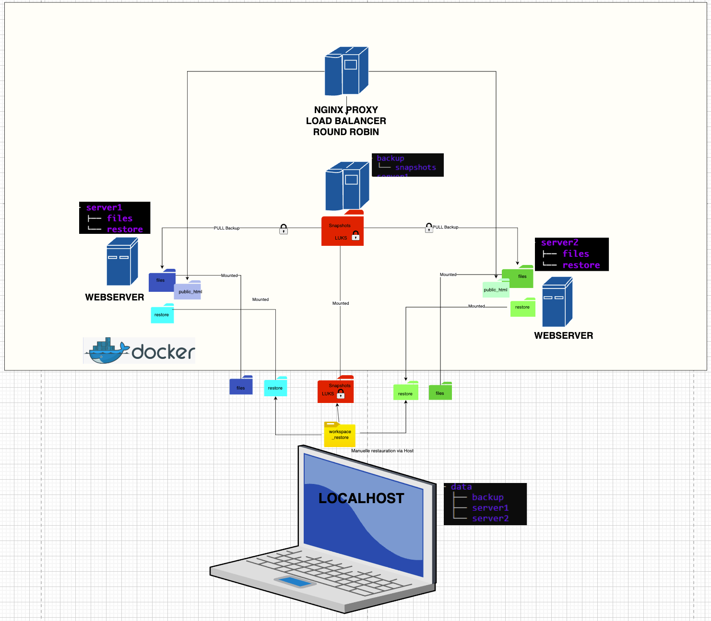

# Automated Resilient Web Infrastructure Deployment (Ansible)

This repository provides an **automated deployment framework** for a resilient web infrastructure combining:

* **Nginx reverse proxy with load balancing**
* **TLS encrypted access**
* **Rsnapshot backup server**
* **LUKS encrypted backup storage**

The infrastructure is deployed automatically using **Ansible**, simulating a cloud deployment workflow similar to provisioning servers on providers such as **Hetzner**.

Instead of using real VPS instances, this project reproduces the same process using **virtual machines** running on **Proxmox / Ludus**.

---

# Architecture Overview



The deployed infrastructure contains:

* **Ansible Controller (vmcontrol)**
* **Target Server – Resilient Web Infrastructure**

The controller connects to the target server via **SSH** and automatically deploys the full environment.

---

# Infrastructure Components

### Ansible Controller (vmcontrol)

Responsible for:

* running the Ansible container
* executing the deployment playbooks
* connecting to the remote server via SSH
* cloning and deploying the infrastructure project

---

### Target Server – Web Infrastructure

Runs a **containerized resilient web architecture**.

The infrastructure contains:

* **Nginx reverse proxy**
* **two backend web servers**
* **a dedicated backup server**

All services are deployed using **Docker Compose**.

---

# Infrastructure Architecture

The deployed infrastructure combines a reverse proxy, round-robin load balancing, and a secure backup architecture using rsnapshot with LUKS encrypted storage:

This deployment repository automatically installs and configures the infrastructure available at:

[https://github.com/TsamD/rsnapshot-luks-proxy](https://github.com/TsamD/rsnapshot-luks-proxy)
[rsnapshot-luks-proxy](https://github.com/TsamD/rsnapshot-luks-proxy)
---

# Reverse Proxy

The **Nginx proxy** acts as the single entry point of the infrastructure.

Responsibilities:

* TLS termination
* request routing
* load balancing between backend servers

Load balancing algorithm:

```
round robin
```

---

# Backend Web Servers

Two backend servers are deployed:

```
server1
server2
```

Each server hosts:

```
files/
├── business
│   ├── clients.txt
│   └── orders.txt
├── config
│   └── app.conf
└── public_html
    └── index.html
```

The backend servers **do not allow direct access from external clients**.

Only the reverse proxy is allowed to connect.

Example restriction:

```
allow proxy-ip
deny all
```

---

# TLS Encryption

Secure communication is provided using **TLS**.

Certificates are automatically generated during deployment using **self-signed certificates**.

The proxy exposes:

```
HTTPS → port 443
```

Docker port mapping:

```
443 (host) → 8080 (nginx container)
```

For testing purposes, the certificate is self-signed.

Example request:

```bash
curl -k https://localhost or curl -k https://iptarget
```

---

# Backup Server

A dedicated container performs automated backups using:

* **rsnapshot**
* **rsync**
* **SSH**

The backup operates in **pull mode**:

```
backup → server1
backup → server2
```

Snapshots are stored inside:

```
/snapshots
```

---

# LUKS Encrypted Backup Storage

Backup data is stored on a **LUKS encrypted disk image**.

Characteristics:

* block-level encryption
* secure storage of backup data
* compatible with rsnapshot hardlink deduplication

The encrypted disk is mounted automatically during deployment.

Example device:

```
/dev/mapper/backup_disk
```

---

# Target Machine Preparation

Freshly cloned virtual machines may share the same `machine-id`, which can cause network conflicts.

Regenerate it before deployment:

```bash
sudo rm /etc/machine-id
sudo systemd-machine-id-setup
sudo reboot
```

---

# SSH Configuration

The deployment assumes an environment similar to **cloud VPS providers such as Hetzner**, where administrative access is performed using **root SSH login**.

Edit:

```
/etc/ssh/sshd_config
```

Enable:

```
PermitRootLogin yes
PasswordAuthentication yes
PubkeyAuthentication yes
```

Restart SSH:

```bash
systemctl restart ssh
```

---

# SSH Key Distribution

From the **Ansible controller machine**, copy the SSH public key to the target machine.

```bash
ssh-copy-id -i ssh_keys/id_rsa.pub root@vmtargetluksproxy
```

---

# Inventory Configuration

Edit the Ansible inventory file:

```ini
[app]
vmtargetluksproxy
```

This machine will receive the automated deployment.

---

# Deployment

Make the deployment script executable:

```bash
chmod +x deploy.sh
```

Run the deployment:

```bash
./deploy.sh
```

The deployment will automatically:

* start the Ansible container
* execute the master playbook
* install required packages
* install Docker
* generate TLS certificates
* clone the infrastructure repository
* configure LUKS encrypted storage
* deploy the Docker-based infrastructure

---

# Installation Path on Target Machine

After deployment, the infrastructure will be installed in:

```
/opt/rsnapshot-luks-proxy
```

This directory contains the full containerized environment.

---

# Verification

Connect to the target server:

```bash
ssh root@vmtargetluksproxy
```

Navigate to the project directory:

```bash
cd /opt/rsnapshot-luks-proxy
```

Check running containers:

```bash
docker ps
```

Test HTTPS access:

```bash
curl -k https://localhost
```

You should see alternating responses from the backend servers.

---

# Project Structure on Target Server

```text
/opt/rsnapshot-luks-proxy
├── Dockerfiles
├── config
├── data
├── docker-compose.yml
├── encrypted_disk.img
└── README.md
```

---

# Technology Stack

* Ansible
* Docker
* Docker Compose
* Nginx
* Rsnapshot
* Rsync / SSH
* TLS (self-signed certificates)
* LUKS disk encryption

---


